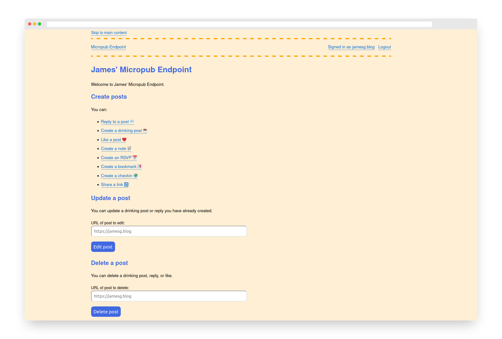

# Micropub Client and Endpoint

This repository contains the code behind my Micropub client and endpoint. Unusually, the client and endpoint are both part of the same codebase. This is because I built this client and endpoint concurrently and wanted to keep the code as part of the same project.

The client.py file contains all of the code for the Micropub client. micropub_helper.py, create_items.py, and micropub.py contain code relevant to the Micropub server.

This application is powered by Python Flask.

## Screenshot

## Specification Compliance

This project is in development. As a result, the contents of this repository have not yet passed the Micropub client or server specifciations published on [micropub.rocks](https://micropub.rocks/).

So far, the receiving end has 30 of the 34 specification requirements in the micropub.rocks implementation report. The implementation report is here:

https://micropub.rocks/implementation-reports/servers/593/qcErwj2OOC2MiSqE6QeU

## Configuration

To use this endpoint, you need to create a config.py file with the following values:

    UPLOAD_FOLDER = "/path/to/website/assets/folder/"
    ALLOWED_EXTENSIONS = set(["png", "jpeg", "jpg"])
    HOME_FOLDER = "/path/to/folder/for/website/"
    ENDPOINT_URL = "https://yourmicropubendpoint.com/micropub"
    MEDIA_ENDPOINT_URL = "https://yourmicropubendpoint.com/media"

    GITHUB_KEY = "GITHUB_ACCESS_TOKEN"
    GOOGLE_API_KEY = "GOOGLE_CLOUD_API_KEY"

    TWITTER_BEARER_TOKEN = "TWITTER_API_TOKEN"

These values are all required for the endpoint to work. UPLOAD_FOLDER and HOME_FOLDER should be where you keep your website assets folder and website root folder, respectively. In my case, UPLOAD_FOLDER points to my /assets/ folder in my Jekyll repository and HOME_FOLDER points to my root folder in my Jekyll repository.

This project uses PyGitHub to upload posts published through the Micropub server to GitHub. For this feature to work, you need to specify a GitHub access token that has access to read and write to a repository.

The Google API key is used for finding locations when you post a checkin. This feature is only implemented when one does not specify the address of where they are in a checkin. To disable this feature, go to the process_checkin() function in create_items.py and comment out the code related to the Google Cloud API.

You will also need to create a folder for each post type you want to support. This is essential because the Micropub server does not create these folders automatically. The folders you need to create to support all post types are:

    - _webmention
    - _rsvp
    - _repost
    - _likes
    - _notes
    - _coffee
    - _bookmark
    - _checkin

## Client Schemas

The /schemas page shows schemas for every POST request the Micropub client can make (excluding media endpoint requests).

You can refer to this page without downloading the client by going to templates/schemas.html in the source code.

You can use these schemas to help understand the data the client will send to a server.

Only JSON objects are documented on the schemas page. Support for form encoded requests is not yet stable and as a result has not been documented on the schemas page.

## Server Role

The role of the server is to turn the POST requests from the client into files that can then be uploaded to a Jekyll blog or any blog that uses similar front matter. You can modify the server to create a different page type. To do so, I would suggest taking a look at the write_to_file() function in create_items.py.

Here is a webmention that the server created after receiving a "reply" POST request from the client:

    category:
    - Webmention
    in-reply-to:
    - https://jamesg.blog
    layout: webmention
    published: 2021-09-12 08:36:55.916905
    title: Webmention to Home   James Coffee Blog

## Relevant Resources

Here are some relevant resources that you might find useful if you are interested in building a Micropub client or server or would like to use the one in this repository:

- [Micropub](https://indieweb.org/Micropub)
- [Micropub Specification](https://www.w3.org/TR/micropub/)